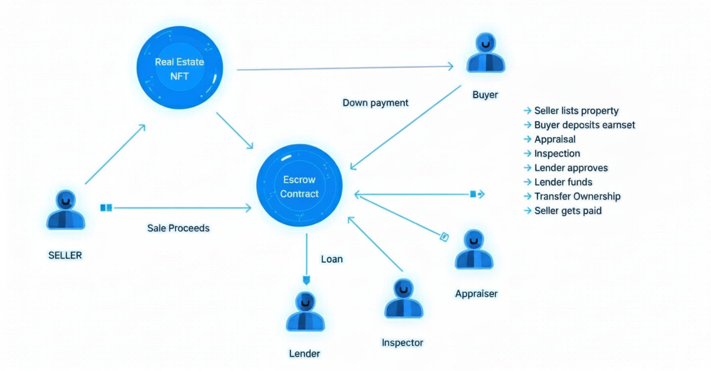

# RWA NFT Blockchain

A minimal Real-World Asset (RWA) demo that mints real estate NFTs and transacts them via an Escrow contract. Learn basic NFT + escrow concepts with a simple frontend and Hardhat backend.



## Prerequisites
- Node.js (>= 16 recommended)
- npm (>= 8)
- MetaMask (browser extension)
- macOS/Linux/Windows

## Install
1. Clone this repo
2. Install dependencies
   ```bash
   npm install
   ```

## Run Tests (smart contracts)
```bash
npx hardhat test
```
You should see the escrow flow tests passing.

## Run Locally (end-to-end)
Follow these steps to run a local Hardhat chain, deploy contracts, and launch the frontend.

1) Start a local Hardhat node (persistent chain)
```bash
npx hardhat node
```
This will print 20 accounts with private keys.

2) In a new terminal, deploy the contracts to the local node
```bash
npx hardhat run scripts/deploy.js --network localhost
```
The script prints the deployed addresses for RealEstate and Escrow.

3) Update frontend config with deployed addresses
- Open: `src/config.json`
- Under chainId `31337`, set:
  - `realEstate.address` to the RealEstate address printed by the deploy script
  - `escrow.address` to the Escrow address printed by the deploy script

Example structure:
```json
{
  "31337": {
    "realEstate": { "address": "0x..." },
    "escrow": { "address": "0x..." }
  }
}
```

4) Start the React app
```bash
npm start
```
The app will open at http://localhost:3000.

5) Connect MetaMask to Hardhat local network (chainId 31337)
- Add a network:
  - Network Name: Hardhat Localhost
  - RPC URL: http://127.0.0.1:8545
  - Chain ID: 31337
  - Currency Symbol: ETH
- Import one of the private keys shown in the `npx hardhat node` output to act as a user.

## Typical Escrow Flow (in the dApp)
- Seller lists property (already handled in deploy script).
- Buyer deposits earnest via “Deposit” action.
- Inspector updates inspection status.
- Buyer, Seller, and Lender approve the sale.
- Lender funds any remaining balance to the Escrow contract.
- Seller finalizes the sale.
- Alternatively, cancel:
  - Buyer can cancel before inspection (earnest refunded).
  - Seller can cancel after inspection (escrow balance to seller).

Note: The current deploy script performs a complete flow for property #2 (including finalization). If you want to leave a property open for interactive testing in the UI, comment out the finalization section in `scripts/deploy.js` for tokenId 2.

## Troubleshooting
- If the frontend shows “Missing escrow.address for chainId 31337” or “No contract code found…”, ensure you:
  - Deployed to the local node (`--network localhost`)
  - Updated `src/config.json` with the printed addresses
  - MetaMask is connected to chainId 31337
- If actions revert with “Not enough balance”, ensure the lender sends the remaining purchase amount to the Escrow contract before finalization.
- After redeploying, restart `npm start` or hard refresh the browser to pick up config changes.

## Useful Commands
- Compile: `npx hardhat compile`
- Run node: `npx hardhat node`
- Deploy (localhost): `npx hardhat run scripts/deploy.js --network localhost`
- Test: `npx hardhat test`

## Resources
- Learn more about building this type of dApp: Learn Blockchain & Solidity Development Full Course 2024 – YouTube: https://www.youtube.com/watch?v=jcgfQEbptdo
